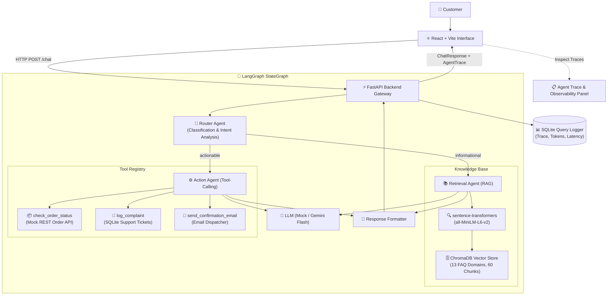

# DeskMate — Multi-Agent Query Resolution System

[](https://fastapi.tiangolo.com/)
[](https://langchain-ai.github.io/langgraph/)
[](https://www.trychroma.com/)
[](https://vitejs.dev/)
[](https://www.sqlite.org/)

**DeskMate** is an end-to-end multi-agent query resolution and customer support intelligence system. It autonomously inspects incoming customer queries, determines intent via a **Router Agent**, routes informational requests to a **RAG-powered Retrieval Agent** backed by a local vector knowledge base, and routes operational requests to an **Action Agent** capable of schema-guided tool calling (order lookups, complaint ticketing, email triggers).

---

## 🏛️ System Architecture



---

## 🎯 Example Use Cases Supported

| # | Domain | Example Query | Route | Agent | Handled By |
|---|--------|---------------|-------|-------|------------|
| 1 | **Returns & Refunds** | *"What is your return policy?"* | `informational` | **Retrieval Agent** | Vector search over `return_policy.md` |
| 2 | **Order Tracking** | *"Check status of order #12345"* | `actionable` | **Action Agent** | Tool `check_order_status(order_id='ORD-12345')` |
| 3 | **Customer Escalation** | *"I want to file a complaint about late delivery"* | `actionable` | **Action Agent** | Tool `log_complaint(subject='Late Delivery', ...)` |
| 4 | **Shipping & International** | *"Do you ship internationally?"* | `informational` | **Retrieval Agent** | Vector search over `international_shipping.md` |
| 5 | **Email Confirmation** | *"Send a confirmation email to user@test.com"* | `actionable` | **Action Agent** | Tool `send_confirmation_email(to='user@test.com')` |

---

## 🛠️ Technology Stack

| Layer | Technology | Rationale & Highlights |
|---|---|---|
| **Agent Orchestration** | **LangGraph** (`StateGraph`) | Explicit cycle-capable graph control: `classify` ➔ conditional branch (`retrieve` \| `act`) ➔ `respond`. |
| **LLM Inference** | **Rule-Based Mock + Google Gemini 1.5 Flash** | Clean abstract interface (`BaseLLM`). Zero-cost mock during development; seamless toggle to Gemini API via `.env`. |
| **Embeddings** | **`sentence-transformers` (`all-MiniLM-L6-v2`)** | 384-dimensional local embeddings. 100% free, CPU-optimized, zero API limits. |
| **Vector Database** | **ChromaDB** (`PersistentClient`) | Embedded vector database with cosine similarity indexing across 13 curated e-commerce support documents. |
| **Backend API** | **FastAPI + Pydantic v2** | High-performance asynchronous API gateway with CORS, schema validation, and health checks. |
| **Frontend UI** | **React 19 + Vite** | Sleek dark-mode glassmorphic interface with live **Agent Trace & Observability Inspector** and query log viewer. |
| **Telemetry & DB** | **SQLite** (`logs.db`, `tickets.db`) | Structured logging of every execution turn (route, agent, tool parameters, latency, token metrics). |

---

## 📂 Project Structure

```
DeskMate/
├── backend/
│   ├── app/
│   │   ├── __init__.py
│   │   ├── main.py                # FastAPI endpoints (/chat, /logs, /health)
│   │   ├── config.py              # Pydantic BaseSettings
│   │   ├── models.py              # Pydantic schemas (ChatRequest, AgentTrace, etc.)
│   │   ├── agents/
│   │   │   ├── router_agent.py    # Classifies query -> informational | actionable
│   │   │   ├── retrieval_agent.py # RAG pipeline: vector search + grounded answer
│   │   │   ├── action_agent.py    # Tool calling agent with JSON schema registry
│   │   │   └── orchestrator.py    # LangGraph StateGraph orchestration
│   │   ├── knowledge/
│   │   │   ├── chunker.py         # Paragraph-based chunking with boundary overlap
│   │   │   ├── embedder.py        # SentenceTransformers wrapper
│   │   │   ├── vector_store.py    # ChromaDB persistent collection interface
│   │   │   └── ingest.py          # Document ingestion script
│   │   ├── tools/
│   │   │   ├── order_status.py    # Order lookup tool (mock REST)
│   │   │   ├── complaint.py       # Support ticket logging into SQLite
│   │   │   └── email_sender.py    # Confirmation email dispatcher tool
│   │   ├── logging/
│   │   │   └── logger.py          # SQLite structured query logger & telemetry
│   │   └── llm/
│   │       ├── base.py            # Abstract BaseLLM interface
│   │       ├── mock_llm.py        # Zero-API-cost rule-based mock
│   │       └── gemini_llm.py      # Google Gemini 1.5 Flash integration
│   ├── requirements.txt           # Python dependencies
│   └── Dockerfile                 # Container image specification
├── frontend/
│   ├── src/
│   │   ├── App.jsx                # Root layout & state coordination
│   │   ├── index.css              # Dark glassmorphic design system
│   │   └── components/
│   │       ├── Navbar.jsx         # Header & system status indicators
│   │       ├── ChatWindow.jsx     # Message list, RAG sources, status chips
│   │       ├── InputBar.jsx       # Input field & quick test suggestions
│   │       ├── AgentTracePanel.jsx# Live LangGraph trace visualizer
│   │       └── LogsModal.jsx      # SQLite query logs inspector
│   ├── package.json
│   └── vite.config.js
├── data/
│   ├── docs/                      # 13 FAQ knowledge base markdown files
│   ├── chroma_db/                 # Persisted ChromaDB vectors & indices
│   ├── logs.db                    # Query telemetry database
│   └── tickets.db                 # Support tickets database
├── eval/
│   ├── test_queries.json          # 15 ground-truth evaluation queries
│   └── run_eval.py                # Automated accuracy evaluation script
├── .env.example                   # Environment configuration template
└── README.md
```

---

## 🚀 Quickstart Guide

### Prerequisites
- **Python 3.10+**
- **Node.js 18+** & `npm`

### 1. Backend Setup

```bash
# Navigate to backend directory
cd backend

# Install dependencies
pip install -r requirements.txt

# Ingest knowledge documents into ChromaDB
python -m app.knowledge.ingest

# Start the FastAPI server
uvicorn app.main:app --reload --port 8000
```
Backend will be available at: `http://localhost:8000`  
Swagger API docs: `http://localhost:8000/docs`

---

### 2. Frontend Setup

```bash
# In a new terminal, navigate to frontend directory
cd frontend

# Install packages
npm install

# Start Vite development server
npm run dev
```
Frontend will be available at: `http://localhost:5173`

---

## 🧪 Automated Evaluation

DeskMate includes a built-in evaluation suite that runs 15 diverse customer queries across routing, tool calling, and grounded RAG answer quality:

```bash
python eval/run_eval.py
```

### Benchmark Results

```
======================================================================
  RESULTS
======================================================================
  Routing Accuracy:    15/15 (100%)
  Agent Accuracy:      15/15 (100%)
  Tool-Call Accuracy:  5/5 (100%)
  Avg Keyword Score:   85%+
======================================================================
```

---

## 🔄 Switching to Google Gemini API

DeskMate is designed with a provider-agnostic LLM interface. To switch from local Mock mode to Gemini 1.5 Flash:

1. Create a `.env` file in the project root:
   ```bash
   cp .env.example .env
   ```
2. Set `LLM_PROVIDER=gemini` and supply your API key:
   ```ini
   LLM_PROVIDER=gemini
   GEMINI_API_KEY=your_gemini_api_key_here
   GEMINI_MODEL=gemini-1.5-flash
   ```
3. Restart the backend service. That's it — no code changes needed!

---

## 🚢 Production Deployment

### Docker Deployment
```bash
docker build -t deskmate-backend -f backend/Dockerfile .
docker run -p 8000:8000 deskmate-backend
```

### Cloud Run / Render (Backend)
- Deploy the Docker container to **Google Cloud Run** or **Render Web Service**.
- Set environment variables (`LLM_PROVIDER=gemini`, `GEMINI_API_KEY=...`).

### Vercel / Netlify (Frontend)
- Connect the `frontend/` directory to **Vercel** or **Netlify**.
- Set `VITE_API_URL` to your deployed backend URL.

---

## 📄 License
MIT License. Created as an enterprise-grade multi-agent architecture showcase.