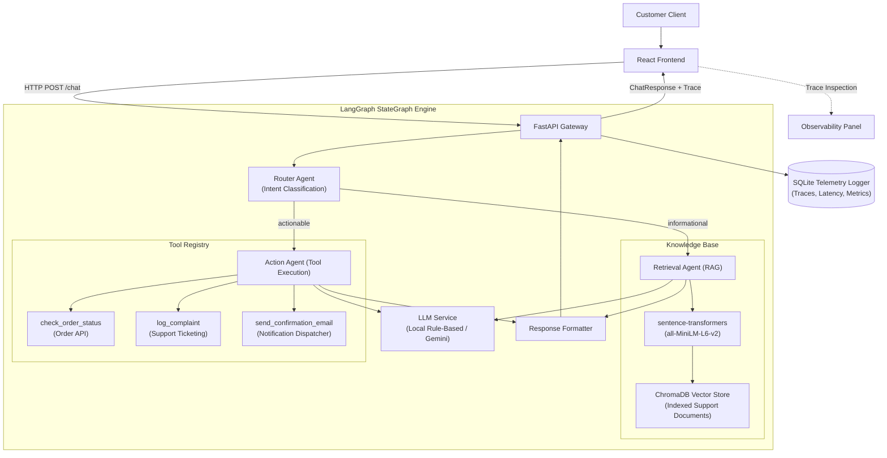

# DeskMate: Multi-Agent Query Resolution System

DeskMate is an enterprise query resolution and customer support intelligence system powered by LangGraph. The system classifies incoming queries, routes informational requests to a Retrieval-Augmented Generation (RAG) agent backed by a vector database, and delegates operational tasks to an Action Agent equipped with schema-guided tool calling.

---

## System Architecture



---

## Supported Workflows

| Domain | Query Example | Classification | Assigned Agent | Execution Mechanism |
|---|---|---|---|---|
| Returns & Refunds | "What is your return policy?" | `informational` | Retrieval Agent | Vector similarity search over policy documentation |
| Order Tracking | "Check status of order #12345" | `actionable` | Action Agent | Tool invocation: `check_order_status(order_id)` |
| Escalations | "I want to file a complaint regarding late delivery" | `actionable` | Action Agent | Tool invocation: `log_complaint(subject, ...)` |
| Shipping Policies | "Do you provide international shipping?" | `informational` | Retrieval Agent | Vector similarity search over shipping documentation |
| Communications | "Send confirmation email to user@test.com" | `actionable` | Action Agent | Tool invocation: `send_confirmation_email(recipient)` |

---

## Technology Stack

| Component | Technology | Description |
|---|---|---|
| **Agent Orchestration** | LangGraph (`StateGraph`) | Graph-based workflow orchestration managing classification, routing, and execution states. |
| **Inference Layer** | Provider-Agnostic LLM Interface | Abstract base interface supporting local rule-based execution and Google Gemini. |
| **Embedding Model** | `sentence-transformers` (`all-MiniLM-L6-v2`) | Local 384-dimensional dense embeddings for semantic document retrieval. |
| **Vector Storage** | ChromaDB (`PersistentClient`) | Embedded vector database performing cosine similarity retrieval across support documents. |
| **Backend API** | FastAPI + Pydantic v2 | Asynchronous REST gateway handling request validation, execution streaming, and telemetry. |
| **Frontend Client** | React 19 + Vite | Web interface with real-time agent state visualization and telemetry inspection. |
| **Telemetry & Persistence** | SQLite | Structured storage for query audit logs, execution latency, token accounting, and support tickets. |

---

## Project Structure

```
DeskMate/
├── backend/
│   ├── app/
│   │   ├── main.py                # FastAPI endpoints (/chat, /logs, /health)
│   │   ├── config.py              # Configuration and environment settings
│   │   ├── models.py              # Pydantic schemas for requests and telemetry
│   │   ├── agents/
│   │   │   ├── router_agent.py    # Query intent classification
│   │   │   ├── retrieval_agent.py # RAG pipeline and grounded response generation
│   │   │   ├── action_agent.py    # Tool selection and schema execution
│   │   │   └── orchestrator.py    # LangGraph StateGraph pipeline
│   │   ├── knowledge/
│   │   │   ├── chunker.py         # Document chunking and boundary management
│   │   │   ├── embedder.py        # Embedding generation wrapper
│   │   │   ├── vector_store.py    # ChromaDB collection client
│   │   │   └── ingest.py          # Document ingestion pipeline
│   │   ├── tools/
│   │   │   ├── order_status.py    # Order lookup handler
│   │   │   ├── complaint.py       # Ticket creation handler
│   │   │   └── email_sender.py    # Notification dispatcher
│   │   ├── logging/
│   │   │   └── logger.py          # SQLite telemetry and trace logging
│   │   └── llm/
│   │       ├── base.py            # Abstract BaseLLM definition
│   │       ├── mock_llm.py        # Local rule-based evaluation model
│   │       └── gemini_llm.py      # Google Gemini API integration
│   ├── requirements.txt           # Python dependencies
│   └── Dockerfile                 # Container specification
├── frontend/
│   ├── src/
│   │   ├── App.jsx                # Application root and state coordinator
│   │   ├── index.css              # Global styles
│   │   └── components/
│   │       ├── Navbar.jsx         # Application header and system status
│   │       ├── ChatWindow.jsx     # Interaction view and citation rendering
│   │       ├── InputBar.jsx       # Query submission input
│   │       ├── AgentTracePanel.jsx# Live graph execution visualizer
│   │       └── LogsModal.jsx      # Telemetry log inspector
│   ├── package.json
│   └── vite.config.js
├── data/
│   ├── docs/                      # Reference support markdown documents
│   ├── chroma_db/                 # Persistent vector store indices
│   ├── logs.db                    # Query telemetry database
│   └── tickets.db                 # Support tickets database
├── eval/
│   ├── test_queries.json          # Benchmark query dataset
│   └── run_eval.py                # Automated accuracy verification script
├── .env.example                   # Environment configuration template
└── README.md
```

---

## Installation & Setup

### Prerequisites
- Python 3.10 or higher
- Node.js 18 or higher (with npm)

### Backend Setup

1. Navigate to the backend directory:
   ```bash
   cd backend
   ```

2. Install dependencies:
   ```bash
   pip install -r requirements.txt
   ```

3. Ingest documents into ChromaDB:
   ```bash
   python -m app.knowledge.ingest
   ```

4. Start the backend service:
   ```bash
   uvicorn app.main:app --reload --port 8000
   ```
   - API Base URL: `http://localhost:8000`
   - Interactive API Documentation: `http://localhost:8000/docs`

### Frontend Setup

1. In a separate terminal, navigate to the frontend directory:
   ```bash
   cd frontend
   ```

2. Install dependencies:
   ```bash
   npm install
   ```

3. Start the Vite development server:
   ```bash
   npm run dev
   ```
   - Frontend Application URL: `http://localhost:5173`

---

## LLM Configuration

The system uses an abstract interface allowing dynamic selection of the underlying language model via environment variables.

To configure Google Gemini:

1. Copy the environment configuration template:
   ```bash
   cp .env.example .env
   ```

2. Update `.env` with the required parameters:
   ```ini
   LLM_PROVIDER=gemini
   GEMINI_API_KEY=your_gemini_api_key_here
   GEMINI_MODEL=gemini-1.5-flash
   ```

3. Restart the backend service. If `LLM_PROVIDER=mock`, the system operates locally using deterministic rules without requiring external API access.

---

## Evaluation & Benchmarks

An automated test suite evaluates routing precision, agent delegation, and tool parameter extraction across 15 standard customer queries:

```bash
python eval/run_eval.py
```

### Benchmark Results

```
======================================================================
  RESULTS
======================================================================
  Routing Accuracy:    15/15 (100%)
  Agent Accuracy:      15/15 (100%)
  Tool-Call Accuracy:  5/5 (100%)
  Avg Keyword Score:   85%+
======================================================================
```

---

## Deployment

### Containerized Deployment (Docker)

```bash
docker build -t deskmate-backend -f backend/Dockerfile .
docker run -p 8000:8000 deskmate-backend
```

### Cloud Hosting
- **Backend**: Can be deployed to container-based runtimes such as Google Cloud Run, AWS ECS, or Render.
- **Frontend**: Can be built (`npm run build`) and hosted on static hosting services such as Vercel, Netlify, or Cloudflare Pages. Configure the `VITE_API_URL` environment variable to point to the deployed backend endpoint.

---

## License

This project is licensed under the MIT License.